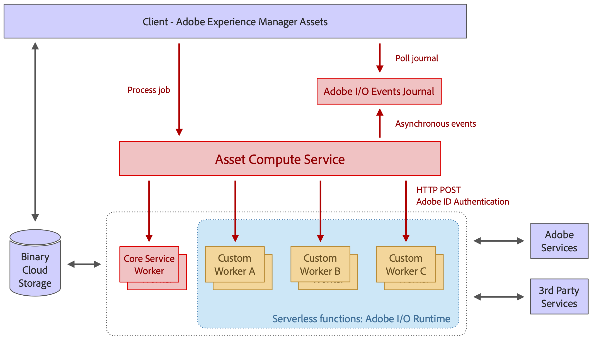

# Arquitectura de [!DNL Asset Compute Service] {#overview}

El [!DNL Asset Compute Service] se basa en servidores sin servidor [!DNL Adobe I/O] Plataforma de tiempo de ejecución. Proporciona compatibilidad con servicios de contenido de Adobe Sensei para recursos. El cliente que invoca (solo [!DNL Experience Manager] as a [!DNL Cloud Service] es compatible) se proporciona con la información generada por Adobe Sensei que buscó para el recurso. La información devuelta está en formato JSON.

[!DNL Asset Compute Service] se puede ampliar creando aplicaciones personalizadas basadas en [!DNL Project Adobe Developer App Builder]. Estas aplicaciones personalizadas son [!DNL Project Adobe Developer App Builder] Las aplicaciones sin encabezado y realizan tareas como agregar herramientas de conversión personalizadas o llamar a API externas para realizar operaciones de imagen.

[!DNL Project Adobe Developer App Builder] es un marco para crear e implementar aplicaciones web personalizadas en [!DNL Adobe I/O] runtime. Para crear aplicaciones personalizadas, los desarrolladores pueden aprovechar [!DNL React Spectrum] (Kit de herramientas de IU de Adobe), cree microservicios, cree eventos personalizados y organice API. Consulte [Documentación del Generador de aplicaciones de Adobe Developer](https://developer.adobe.com/app-builder/docs/overview).

La base sobre la que se basa la arquitectura incluye lo siguiente:

* La modularidad de las aplicaciones, que solo contienen lo necesario para una tarea determinada, permite desacoplar las aplicaciones entre sí y mantenerlas ligeras.

* El concepto sin servidor de [!DNL Adobe I/O] El tiempo de ejecución ofrece numerosas ventajas: procesamiento asincrónico, altamente escalable, aislado y basado en trabajos, que es perfecto para el procesamiento de recursos.

* El almacenamiento en la nube binaria proporciona las funciones necesarias para almacenar y acceder a los archivos y representaciones de recursos de forma individual, sin requerir permisos de acceso completos al almacenamiento, mediante referencias de URL firmadas previamente. La aceleración de la transferencia, el almacenamiento en caché de CDN y la co-ubicación de aplicaciones informáticas con almacenamiento en la nube permiten un acceso óptimo a contenido de baja latencia. Se admiten las nubes de AWS y Azure.

*Figura: Arquitectura de [!DNL Asset Compute Service] y cómo se integra con [!DNL Experience Manager], almacenamiento y aplicación de procesamiento.*

La arquitectura consta de las siguientes partes:

* **Una capa de API y orquestación** recibe solicitudes (en formato JSON) que indican al servicio que transforme un recurso de origen en varias representaciones. Las solicitudes son asincrónicas y se devuelven con un ID de activación, es decir, un ID de trabajo. Las instrucciones son puramente declarativas y, para todo el trabajo de procesamiento estándar (por ejemplo, generación de miniaturas, extracción de texto), los consumidores solo especifican el resultado deseado, pero no las aplicaciones que administran determinadas representaciones. Las funciones de API genéricas, como autenticación, análisis y limitación de velocidad, se gestionan mediante la puerta de enlace de API de Adobe delante del servicio y administran todas las solicitudes que se dirigen a [!DNL Adobe I/O] Runtime. El enrutamiento de la aplicación se realiza dinámicamente mediante la capa de orquestación. Los clientes pueden especificar aplicaciones personalizadas para representaciones específicas e incluir parámetros personalizados. La ejecución de aplicaciones se puede paralelizar completamente, ya que son funciones independientes sin servidor en [!DNL Adobe I/O] Runtime.

* **Aplicaciones para procesar recursos** que se especializan en ciertos tipos de formatos de archivo o representaciones de destino. Conceptualmente, una aplicación es como el concepto de canalización Unix: un archivo de entrada se transforma en uno o más archivos de salida.

* **A [biblioteca común de aplicaciones](https://github.com/adobe/asset-compute-sdk)** gestiona tareas comunes como la descarga del archivo de origen, la carga de representaciones, la creación de informes de errores, la entrega de eventos y la monitorización Esto está diseñado para que el desarrollo de una aplicación sea lo más sencillo posible, siguiendo la idea sin servidor, y pueda restringirse a las interacciones del sistema de archivos local.

<!-- TBD:

* About the YAML file?
* minimize description to custom applications
* remove all internal stuff (e.g. Photoshop application, API Gateway) from text and diagram
* update diagram to focus on 3rd party custom applications ONLY
* Explain important transactions/handshakes?
* Flow of assets/control? See the illustration on the Nui diagrams wiki.
* Illustrations. See the SVG shared by Alex.
* Exceptions? Limitations? Call-outs? Gotchas?
* Do we want to add what basic processing is not available currently, that is expected by existing AEM customers?
-->
